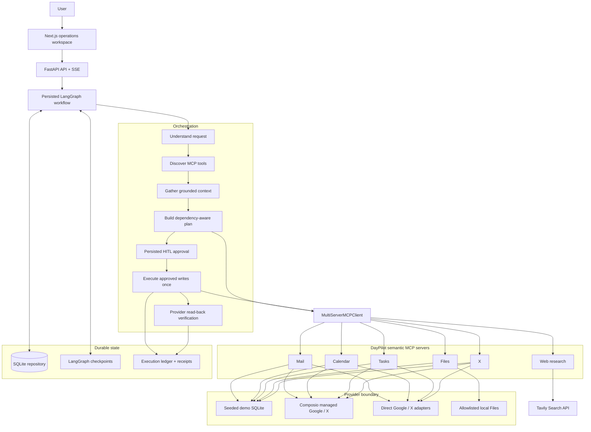
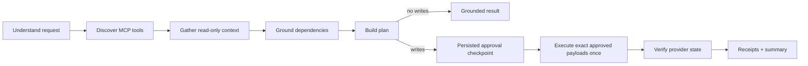

# DayPilot

**MCP-powered personal operations agent.**

DayPilot turns a natural-language operational goal into a grounded plan across
connected services. LangGraph coordinates semantic MCP tools, reads can run
autonomously, and every external write pauses at a persisted human approval
checkpoint before it is executed idempotently and verified against the provider.

## Demo

Try this in the local workspace:

> Find my latest email with subject “DayPilot interview test”. Determine the interview date and time from that email. Check my calendar and find a free 60-minute preparation slot before the interview. Create a calendar event called “DayPilot Interview Prep” in that free slot and create one Google Task called “Prepare for DayPilot interview”. Do not draft or send any email. Show me the proposed plan and dependency graph before making any external changes.

The representative flow is:

1. Search Gmail and read the matching thread.
2. Ground the interview date, time, and timezone from the message.
3. Read Calendar and find a free 60-minute slot before it.
4. Show the plan and its true dependencies.
5. Pause for approval.
6. Create the Calendar event and Google Task exactly once.
7. Verify both provider resources and show receipts.

In demo mode this uses deterministic seeded data. In connected mode the same
semantic MCP contract routes Mail, Calendar, and Tasks through the configured
provider adapters.

## Architecture



DayPilot keeps orchestration separate from service capabilities:

`LangGraph → MultiServerMCPClient → semantic DayPilot MCP server → provider adapter → provider`

The graph never imports Gmail, Calendar, Tasks, Files, X, or web-provider
functions. It discovers a stable semantic surface of **6 MCP domains and 21
tools**.

## Why MCP

Provider APIs expose large, changing, provider-specific action sets. DayPilot
keeps that complexity behind a small semantic boundary:

```text
provider-specific APIs
        ↓
DayPilot semantic MCP tools
        ↓
planner-facing capability contract
```

For example, the planner reasons about `create_event`, not a provider-specific
Google action slug. The adapter can change without changing the graph policy or
the user-facing workflow.

## Agent workflow



The typed LangGraph state carries the request, `UserIntent`, discovered tool
metadata, service context, plan revision, approval hash, execution results,
verification results, errors, and preferences. Historical runs reopen from
persisted application records and LangGraph checkpoints; they do not regenerate
plans or rerun providers.

## Human-in-the-loop safety

- Read tools are autonomous during context gathering.
- Tool risk is code-classified; unknown tools fail closed as side effects.
- Writes pause through LangGraph `interrupt()` and a durable checkpoint.
- Approval is bound to the exact action IDs, tool names, arguments, dependencies,
  and plan hash.
- “Do it immediately” or “do not ask for approval” cannot bypass the gate.
- The gateway rejects writes without matching persisted authorization.

## Dependency-aware planning

Dependencies represent real runtime data flow, not decorative arrows. In the
interview workflow:

```text
search_mail
    ↓ grounded thread_id
get_thread
    ↓ grounded interview datetime
list_events ───────┐
find_free_slots ────┤
        ↓ selected free slot
create_event   create_task
```

`thread_id`, Calendar windows, duration, and write timestamps are derived from
successful semantic results or direct user input. Symbolic placeholders are
never evaluated or sent to MCP. If evidence is missing or a prerequisite
fails, dependent actions are blocked rather than fabricated.

## Connected services

| Domain | Semantic tools | Current provider path |
| --- | --- | --- |
| Mail | `search_mail`, `get_thread`, `get_message`, `create_draft` | Demo SQLite, Composio-managed Google, or direct Gmail |
| Calendar | `list_events`, `find_free_slots`, `create_event` | Demo SQLite, Composio-managed Google Calendar, or direct Google Calendar |
| Tasks | `list_tasks`, `create_task`, `create_task_batch`, `complete_task` | Demo SQLite, Composio-managed Google Tasks, or direct Google Tasks |
| Files | `search_files`, `list_files`, `get_file_metadata`, `read_file` | Seeded demo data or allowlisted local folders; read-only |
| X | `search_posts`, `get_post`, `get_user_posts`, `create_post_draft`, `publish_post` | Demo data, direct X, or managed Composio when available |
| Web | `search_web` | Tavily Search API; read-only and optional |

Connected Google mode uses one server-only Composio key and hosted MCP session
for Gmail, Calendar, and Tasks. Managed X availability depends on the configured
Composio app. Provider failures never fall back to demo data. See
[docs/connected-mode.md](docs/connected-mode.md) for the connection lifecycle.

## Verification and idempotency

Each approved write gets an execution-ledger row before invocation. A duplicate
resume reuses that record instead of issuing a second mutation. Successful
Calendar, Tasks, Mail draft, and X mutations are normalized into semantic
results, read back through MCP where supported, and projected into verified,
created-unverified, or failed receipts. An interrupted write with an unknown
outcome is surfaced and is not blindly retried.

## Evaluation

The deterministic evaluation suite currently covers **20 scenarios** across all
five semantic domains. The latest verified run reports:

- Scenario pass rate: **20/20 (100%)**
- Dependency accuracy: **100%**
- Approval correctness: **100%**
- Execution success: **100%**
- Unauthorized-write rate: **0%**

Evaluation and provider tests use isolated databases or fakes; real connected
provider writes are never part of automated evaluation.

## Tech stack

- **Frontend:** Next.js 16, React 19, TypeScript, Vitest
- **Backend:** FastAPI, Python, Pydantic, Uvicorn
- **Agent:** LangGraph, LangChain, OpenAI structured reasoning
- **Integration:** MCP, `langchain-mcp-adapters`, Composio managed sessions, Tavily web search
- **Persistence:** SQLite, `aiosqlite`, LangGraph SQLite checkpoints
- **Quality:** Pytest, Ruff, ESLint, TypeScript, deterministic evaluations

## Run locally

Prerequisites: Python 3.13 (the `Makefile` uses `python3.13`) and Node.js 22+
(required by the optional vinext/Cloudflare build tooling).

```bash
make install
cp .env.example .env
make dev
```

Open [http://localhost:3000](http://localhost:3000). The API runs at
[http://localhost:8000](http://localhost:8000), with OpenAPI docs at
[http://localhost:8000/docs](http://localhost:8000/docs).

The default `.env.example` configuration is deterministic demo mode and does
not require an OpenAI or provider key. Use `make reset-demo` to restore the
seeded Mail, Calendar, Tasks, Files, and X workspace without deleting DayPilot
run history or preferences.

## Configuration

Copy `.env.example` to `.env`; it contains placeholders only. The settings most
people need are:

```dotenv
DAYPILOT_DEMO_MODE=true
DAYPILOT_PROVIDER_MODE=managed
DAYPILOT_TIMEZONE=Asia/Kolkata
DATABASE_URL=sqlite:///./data/daypilot.db
OPENAI_API_KEY=
COMPOSIO_API_KEY=
TAVILY_API_KEY=
NEXT_PUBLIC_API_URL=http://localhost:8000
```

Set `DAYPILOT_DEMO_MODE=false` and provide `COMPOSIO_API_KEY` for managed
Google connectivity, then connect accounts from Preferences. Optional
`LANGSMITH_TRACING` / `LANGSMITH_API_KEY` enable tracing. Local Files requires
an explicit allowlisted folder in Preferences. Set `TAVILY_API_KEY` to enable
fresh public web research; without it DayPilot reports that search is unavailable
instead of fabricating fresh information. Never put provider secrets in
`NEXT_PUBLIC_*` variables.

## Project structure

```text
backend/
  app/
    graph/          LangGraph state and workflow
    mcp/            MCP gateway and tool policy
    providers/      Managed, direct, and local adapters
    services/       Planner, reasoner, coordinator, receipts
    domain/         Typed models and errors
    persistence/    SQLite repository
  tests/            Workflow, safety, provider, and dependency regressions
frontend/
  src/components/  Operations workspace and graph UI
  src/lib/          API client, types, presentation helpers
mcp_servers/
  common/           Shared demo schema, seed, and store
  mail/ calendar/ tasks/ files/ x/ web/
evaluation/         Deterministic scenario suite
docs/               Architecture, demo, connected mode, and interview notes
scripts/            Local development runner
```

## Testing

```bash
make test
make lint
make eval
cd frontend && npm run build
```

For a single layer:

```bash
./.venv/bin/pytest -q backend/tests
cd frontend && npm test -- --run
```

## Engineering decisions

1. **Semantic MCP boundary:** provider-specific action churn stays outside the
   planner-facing contract.
2. **Code-enforced risk policy:** approval cannot be bypassed by prompt wording
   or a model-selected tool.
3. **Persisted HITL:** approval survives refreshes and resumes the same graph
   checkpoint rather than relying on UI state.
4. **Grounded dependencies:** downstream arguments come from typed semantic
   results, never symbolic placeholder evaluation.
5. **Verification plus idempotency:** external mutations are recorded, not
   blindly retried, and read back when practical.

## Status and limitations

- This is a portfolio-grade local operations system, not a multi-tenant SaaS.
- Demo mode is fully seeded and deterministic; connected mode requires the
  user's own provider authorization.
- Local Files is read-only and requires explicit folder allowlisting.
- Google Tasks stores due dates; exact due times are not preserved by the
  provider API.
- X managed connectivity may be unavailable depending on Composio app support.
- Fresh public web research requires a Tavily API key.
- Some provider responses can be reported as created-unverified when they do not
  return enough stable information for deterministic read-back correlation.

## Further reading

- [Architecture deep dive](docs/architecture.md)
- [Safe demo walkthrough](docs/demo.md)
- [Connected mode setup](docs/connected-mode.md)
- [Project and interview notes](docs/project-notes.md)
