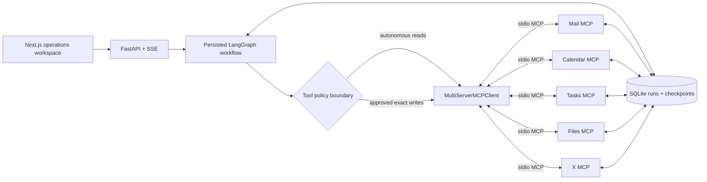

# DayPilot

**An MCP-powered personal operations agent that gathers multi-service context, builds auditable plans, and requires human approval before external state changes.**

DayPilot is a production-shaped local demo of a tool-use agent rather than a chatbot. A user supplies an operational goal—such as preparing for tomorrow's interview—and watches a persisted LangGraph workflow discover tools, read mail/calendar/task context, propose exact mutations, pause for approval, execute only the approved payloads, verify the resulting state, and report what actually happened.

The included workspace is fictional and clearly labeled **Demo workspace**. No personal Google account is required. A hosted demo is intentionally not deployed yet.



## Why it exists

Many agent demos hide their most important behavior inside one tool-calling loop. DayPilot makes the workflow inspectable. LangGraph is used because request understanding, context gathering, planning, approval, execution, verification, and cancellation have explicit state and branches. MCP keeps service capabilities independent from orchestration: the graph never imports a service function. It discovers LangChain-compatible tools from five real MCP server processes covering communication, scheduling, tasks, private workspace documents, and public X context.

The design is deliberately small enough to explain in an interview. There is one API service, one frontend, five local MCP adapters, one SQL repository boundary, and no vector database or multi-agent swarm.

## Core workflow

The graph runs these nodes:

1. `understand_request` produces a typed `UserIntent`.
2. `discover_tools` retrieves current MCP capabilities dynamically.
3. `gather_context` executes a bounded set of read-only tool calls.
4. `build_plan` creates typed actions with tool, arguments, reason, risk, and status.
5. `approval_gate` calls LangGraph `interrupt()` when writes exist.
6. `execute_actions` runs each approved write once and records its outcome.
7. `verify_execution` reads service state back through MCP.
8. `summarize` reports exact successes and failures; rejection routes to `summarize_cancelled`.

With an `OPENAI_API_KEY`, structured OpenAI reasoning interprets requests and selects bounded read tools. Without a key, a deterministic local reasoner exercises the same graph, typed state, MCP boundary, and approval policy. This makes the golden demo and evaluations reproducible while leaving the reasoning provider replaceable.

## Safety boundary

Read and write classifications live in an application policy registry around discovered MCP tools. Unknown tools fail closed as side effects. The context-gathering stage cannot invoke a write because the gateway rejects it without authorization.

Approval is not a frontend flag. `approval_gate` persists a real LangGraph checkpoint and pauses the thread. The approve endpoint resumes that same thread with `Command(resume=...)`. Authorization is bound to a SHA-256 digest of the exact approved action IDs, tool names, and arguments. Changed arguments, missing approval, a mismatched action, or a modified plan hash are rejected in code.

Each write gets a unique execution record before invocation. Duplicate resumes do not repeat it. An interrupted write with an unknown outcome is surfaced rather than retried. Successful calendar, task, and draft mutations are verified using read tools. The agent can act only through declared MCP capabilities; arbitrary Python and shell execution are never exposed.

## Local demo services

- **Mail MCP:** `search_mail`, `get_thread`, `get_message`, `create_draft`
- **Calendar MCP:** `list_events`, `find_free_slots`, `create_event`
- **Tasks MCP:** `list_tasks`, `create_task`, `create_task_batch`, `complete_task`
- **Files MCP:** `search_files`, `list_files`, `get_file_metadata`, `read_file`
- **X MCP:** `search_posts`, `get_post`, `get_user_posts`, `create_post_draft`, `publish_post`

Files and X use small fictional local demo corpora. Files are read-only and accept only controlled file IDs; X reads are autonomous while draft creation and publishing remain approval-gated writes.

The seeded golden prompt is: **“Prepare me for my interview with Rahul tomorrow.”** Mail contains a fictional confirmation for 11:00 AM, the calendar has morning commitments and free evening time, and tasks contain unrelated work. DayPilot proposes a 7:00–8:30 PM preparation block, four tasks, and a saved follow-up draft, then waits. Approval creates and verifies all three changes.

## Run locally

Requirements are Python 3.11+ and Node.js 20+.

```bash
make install
cp .env.example .env
make dev
```

Open `http://localhost:3000`. The API runs at `http://localhost:8000`; its OpenAPI schema is available at `/docs`. `make reset-demo` restores the fictional service records. Use `OPENAI_API_KEY` only if you want model-backed structured reasoning; the complete demo runs without it. `LANGSMITH_API_KEY` and `LANGSMITH_TRACING=true` optionally enable traces for graph nodes and LangChain/MCP calls.

## Quality and evaluation

```bash
make test       # Pytest and Vitest
make lint       # Ruff, ESLint, TypeScript
make eval       # deterministic agent scenarios across all five MCP domains
cd frontend && npm run build
```

Evaluations cover calendar and mail reads, free-slot discovery, scheduling, checklist creation, draft creation, task completion, and the golden workflow. They measure tool-selection accuracy, plan validity, approval correctness, execution success, and unauthorized-write rate. The last metric must remain exactly zero.

## Persistence and deployment scope

SQLite stores application runs, semantic events, preferences, write records, demo-service state, and LangGraph checkpoints. SQL access is isolated in a repository so a PostgreSQL adapter can replace it; LangGraph's async SQLite checkpointer can likewise be exchanged for `AsyncPostgresSaver`. MCP connection configuration already separates transport from the graph, allowing hosted streamable HTTP servers later.

The frontend is compatible with standard Next.js hosting and the FastAPI service is Render-style deployable. External Gmail/Google Calendar adapters, authentication, sending email, billing, RAG, and automatic deployment are intentionally outside V1. Real integrations can replace demo MCP servers without changing graph policy or node structure.
