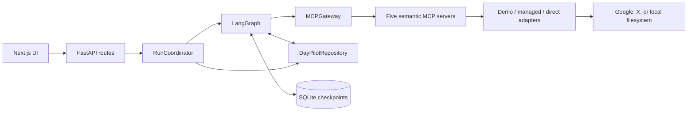

# DayPilot architecture

This document explains the runtime boundaries behind the concise overview in
the [README](../README.md). DayPilot is intentionally a single workflow with
durable state, not a collection of autonomous agents.

## Runtime boundaries



The application has four intentionally separate concerns:

- **Orchestration:** LangGraph nodes and conditional edges own workflow state
  and approval branching.
- **Capability access:** `MCPGateway` discovers tools from isolated MCP server
  processes and enforces the tool policy before every invocation.
- **Provider selection:** each semantic server resolves its adapter from the
  current demo/managed/direct configuration.
- **Durability:** the repository stores application records while the LangGraph
  SQLite checkpointer stores resumable graph state.

The graph does not import provider adapters or call provider SDKs. The only
planner-facing names are the semantic MCP tools listed in the README.

## Request lifecycle

1. `RunCoordinator.start_run` creates an application run and a unique LangGraph
   thread ID, then starts the graph in the background.
2. `understand_request` produces a typed `UserIntent`. OpenAI structured
   reasoning is optional; the deterministic reasoner is the fallback.
3. `discover_tools` asks each MCP server for its current tools and attaches
   policy-derived risk metadata.
4. `gather_context` asks the reasoner for bounded read calls. The planner orders
   dependent reads, grounds their arguments from accumulated results, and records
   each call in the application timeline.
5. `build_plan` merges grounded reads with proposed writes, validates tool
   policy and dependencies, persists the plan revision, and computes the exact
   write hash.
6. If no writes remain, `summarize` returns a grounded read-only result. If
   writes exist, `approval_gate` persists a LangGraph interrupt and waits.
7. The approve endpoint resumes the same thread. `execute_actions` checks the
   persisted approval, hash, action ID, tool, and arguments before each write.
8. `verify_execution` performs provider read-back where a deterministic match is
   possible, then `summarize` builds receipts and closes the run.

## Typed state and persistence

`DayPilotState` carries the request, typed intent (serialized at the graph
boundary), available tool metadata, per-service context, plan/read/write action
lists, approval status and hash, revision number, execution and verification
results, errors, preferences, and timestamps.

The SQLite application repository stores:

- run records and statuses;
- timeline events;
- execution records keyed by `(run_id, action_id)`;
- preferences and provider mode selections;
- local Files roots and managed connection metadata.

The LangGraph checkpointer stores thread snapshots, pending interrupts, and
resume state. This is why approval survives a browser refresh and why a historical
run can be reopened without calling the model or providers again.

## MCP capability boundary

The five local MCP servers expose a stable semantic contract:

```text
mail      search_mail, get_thread, get_message, create_draft
calendar  list_events, find_free_slots, create_event
tasks     list_tasks, create_task, create_task_batch, complete_task
files     search_files, list_files, get_file_metadata, read_file
x         search_posts, get_post, get_user_posts, create_post_draft, publish_post
```

The server process selects a service adapter at call time. Demo mode uses the
seeded SQLite store. Managed Google uses a server-side Composio hosted MCP
session. Direct mode uses the existing direct API adapters. Files uses a local
allowlist and stays read-only.

Provider-specific names and credentials do not enter LangGraph state or the
frontend. Adapter results are normalized back into semantic fields such as
`thread_id`, `start_at`, `end_at`, and task IDs.

## Dependency semantics

`PlanAction.depends_on` contains IDs of earlier actions whose information is
required by that action. The planner validates missing IDs, duplicate IDs,
self-dependencies, cycles, and forward references.

For a cross-service interview request, a valid plan may look like:

```text
search_mail ───────────────┐
                           ▼
                       get_thread
                       /        \
                      ▼          ▼
                list_events  find_free_slots
                                    │
                            ┌───────┴───────┐
                            ▼               ▼
                     create_event      create_task
```

Dependencies have runtime meaning. After `search_mail` succeeds, the planner
binds the ranked semantic `thread_id` into `get_thread`. After the thread is
read, the planner parses the grounded interview datetime in the configured
timezone and derives bounded Calendar windows. The user's requested duration
is propagated into `find_free_slots`. A successful slot becomes the event's
approved start/end.

No general template evaluator exists. Values such as `{{thread_id}}` or
`<resolved interview time>` are treated as unresolved and blocked before MCP
invocation. A dependent write is removed when its prerequisite failed or did not
produce the required evidence; unrelated grounded writes can remain eligible.

## Risk and approval boundary

Risk is determined by the application policy registry, not by model wording.
Reads are safe to run during context gathering. Writes require a
`WriteAuthorization` containing:

- the current run and action IDs;
- the exact tool and argument payload;
- the approved plan hash;
- the full approved action tuple.

The gateway compares all of these before invoking a side-effecting MCP tool.
The graph cannot reach execution with a missing or mismatched approval. A user
request to skip approval changes no policy.

## Execution, verification, and failure semantics

Before a write is attempted, the repository inserts an execution record. The
unique `(run_id, action_id)` key makes a repeated resume idempotent. Results are
stored even when a provider fails. An unknown outcome is not retried blindly.

Verification uses semantic read tools:

- Calendar events are matched by title and normalized instant.
- Tasks are matched by provider ID, title, and date-only due semantics.
- Mail drafts are read back by returned message ID.
- X drafts/posts are checked through the corresponding read path.

Provider results that do not expose enough stable identifiers are reported as
created-unverified rather than guessed. Read failures are preserved in the
timeline and context; they do not silently turn into successful writes.

## Connected-mode safety

Connected mode changes adapter selection, not graph policy. Composio credentials
remain server-side, and the graph still sees only semantic MCP tools. Provider
errors are not converted into demo data. Demo reset is a separately guarded
application operation and cannot target connected providers.

The managed Google path currently covers Gmail, Google Calendar, and Google
Tasks through the `googlesuper` toolkit. Managed X availability is dependent on
Composio app support. See [connected-mode.md](connected-mode.md) for setup and
account lifecycle details.

## Evaluation strategy

The evaluation runner creates a fresh SQLite database for every scenario, seeds
the demo services, runs the real graph, and measures tool selection, plan
validity, approval correctness, dependency accuracy, execution success, and
unauthorized writes. Write scenarios only execute inside isolated demo stores.

The backend test suite separately covers the repository, MCP services, planner,
provider adapters, approval policy, verification receipts, dependency graph,
and maintenance controls.
